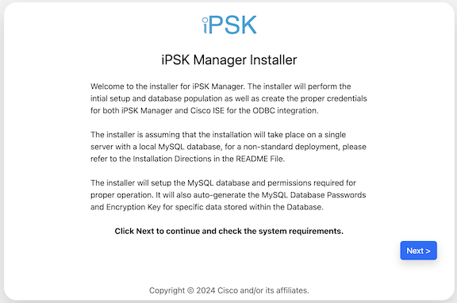
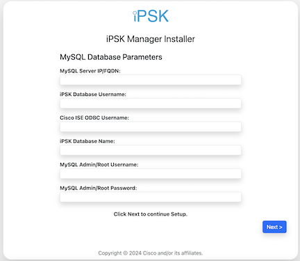

# iPSK-Manager Docker Container

This project is dedicated to the development of a Docker container image tailored for those who prefer the convenience and flexibility of running [iPSK Manager](https://github.com/CiscoDevNet/iPSK-Manager) within a Docker environment. The current Docker build process incorporated in this project encompasses several key features:

- Persistent Storage: The project supports persistent storage for both MySQL databases and iPSK Manager configuration files. This ensures that your data and settings are retained across container restarts and rebuilds.
- SAML Single Sign-On (SSO): Integration with SAML SSO is facilitated through Shibboleth Service Provider (SP) for those who wish to enable SSO in iPSK Manager.
- MySQL Database Flexibility: Users have the option to utilize MySQL within the container or to connect to an external MySQL database, depending on their infrastructure and requirements.
- Simplified Upgrade Process: The project offers a straightforward method for upgrading iPSK Manager, minimizing downtime and complexity.

*Please note that in order to benefit from persistent storage, it is crucial to adhere to the provided guidelines on creating and attaching the necessary persistent storage volumes to your Docker container. It is also important to understand that Docker volumes are not inherently backed up. Therefore, the responsibility lies with you to ensure that backups of the MySQL database and iPSK Manager configuration files are regularly performed to safeguard your data.*

## Build Process

Prior to proceeding with the build and installation of the container, it is essential to confirm that Docker is installed on the system intended for use. Docker Desktop is not a necessity for this operation, as the forthcoming instructions are designed to utilize the command-line interface (CLI) for the construction and deployment of the Docker container.

Please ensure that the Docker engine is properly set up and functioning on your machine. You can verify the installation and check the version of Docker by executing the following command in your terminal or command prompt:

```
docker --version
```

If Docker is not installed, you will need to download and install the appropriate version for your operating system. Detailed instructions for installing Docker can be found on the official Docker documentation website. Once Docker is successfully installed, you may proceed with the build and run instructions for the Docker container as outlined below.

## Downloading Build Files

To clone this GitHub repository to your device using Git, you can follow these steps:
1.	Open a terminal window (on Linux or macOS) or command prompt/PowerShell (on Windows).
2.	Navigate to the directory where you want the cloned repository to be placed using the cd (change directory) command.
3.	Use the git clone command followed by the repository's URL. 

```
get clone https://github.com/PubSec-Security-DevNet/iPSK-Manager-Docker.git
```

Alternatively, you can also download a zip file from the GitHub repository for this project and unzip it in the directory you want to use.

## Build arguments

- SQL_PASSWORD=\<password\> 
    - Password for installation database account (Default: Cisco1234)
- SSO_ENABLED=\<true/false\>
    - Option to enable or disable Shibboleth SSO process and Apache configuration in container (Default: false)
- MYSQL_ENABLED=\<true/false\>
    - Option to enable or disable MySQL process from running within container (Default: true)

## Persistent Volumes

To ensure that your iPSK Manager configuration and MySQL database remain intact when you refresh or update the Docker container, persistent storage must be set up. This is achieved by creating Docker volumes that will store this data outside of the container's lifecycle. The following commands should be executed in your terminal or command prompt to initialize the persistent storage volumes. This step is necessary only once, before you build the container image for the first time.
1.	Create a Docker volume for the iPSK Manager configuration:
```
docker volume create ipskconfig
```
2.	Create a Docker volume for the MySQL database:
```
docker volume create mysqldata
```
These commands will create two separate Docker volumes, one for the iPSK Manager configuration and another for the MySQL database. The data stored in these volumes will persist across container rebuilds and restarts, ensuring that your configuration and database are not lost during updates or maintenance.

## Apache Configuration

To configure Apache with SSL support within your Docker container, you need to place the necessary SSL certificate files in the designated directory and ensure that the virtual host (vhost) configuration files correctly reference these certificates. Follow these steps to set up Apache with SSL:
1.	Obtain your CA (Certificate Authority) certificate file, server certificate file, and server private key file.
2.	Locate the apache-config/ssl directory within your local copy of the repository.
3.	Copy the CA certificate, server certificate, and server private key files into the apache-config/ssl folder.
4.	Open the Apache vhost configuration files located in the apache-config/vhosts directory.
5.	Update the paths to the SSL certificate files within the vhost configuration files to match the filenames of the certificates you placed in the apache-config/ssl folder. Typically, you would adjust the SSLCertificateFile, SSLCertificateKeyFile, and SSLCertificateChainFile (if required) directives.
6.	If necessary, make any other adjustments to the vhost files to suit your specific setup, such as defining the ServerName, ServerAdmin, or other directives. However, do not change the filenames of the vhost configuration files.

*Note: It is important to retain the default logging settings in the Apache vhost configuration files. Apache is configured to stream logs to stdout and stderr in this Docker container setup, which aligns with container best practices. Log rotation is not included in the container image, and by streaming logs to stdout and stderr, you allow Docker to handle the logs, which can then be accessed via Docker commands or managed by a separate logging driver or a log management tool.*

## Shibboleth Configuration (SSO Enabled Only)

*Please be aware of the importance of the default files located in the shibboleth/config directory. Even if there is no immediate intention to activate Single Sign-On (SSO) capabilities, the existing files in this directory must remain. Deleting these files could disrupt the Docker build process. Making changes to the files is required if you are using SSO for iPSK Manager.*

When configuring the Shibboleth Service Provider (SP), it is essential to adhere to the guidelines provided in the official documentation on the Shibboleth website. The configuration process typically involves specifying the identity provider details, setting up attribute mappings, and customizing session handling, among other settings.

Here are the steps to ensure proper configuration and deployment of Shibboleth SP in your Docker container:
1.	Place or edit the configuration files required by Shibboleth SP, such as attribute-map.xml, shibboleth2.xml, and any metadata files, into the shibboleth/config folder. These will be copied to the /etc/shibboleth directory within the container during the build process.
2.	Be mindful that Shibboleth configuration files are not stored in persistent storage. To preserve your Shibboleth configuration across container updates, ensure that all necessary files are maintained within the shibboleth/config directory.
3.	If sp-cert.pem and sp-key.pem files do not exist in the shibboleth/config directory, a new certificate and key for SAML assertion signing will be automatically generated when the container is first launched.
4.	It is crucial to understand that access to the iPSK Manager Apache pages will be restricted until the SAML login functionality is fully operational. Once SAML authentication is successfully established, you must install and then log in to the iPSK Manager and navigate to the Platform Configuration section to enable SAML support officially within iPSK Manager.

## Build Docker Image

To build the iPSK Manager Docker image on your system, please follow these steps:
1.	Open a command-line interface (CLI) on your computer. This could be Terminal on macOS or Linux, or Command Prompt or PowerShell on Windows.
2.	Navigate to the base directory of the iPSK Manager Docker repository that you have either cloned or downloaded. Use the cd command to change directories to the location where the repository resides on your system. For example:

```
cd /path/to/ipsk-manager-docker
```

3.	Once you're in the correct directory, run the following Docker build command to build the image with default options, other examples are below:

```
docker build -t ipskmanager-image . --no-cache
```

Breaking down this command:
-	**docker build** is the Docker command used to create a Docker image from a Dockerfile.
-	**-t ipskmanager-image** assigns the tag "ipskmanager-image" to the new Docker image, which allows you to easily reference the image later.
-	**.** (a period) tells Docker to look for the Dockerfile in the current directory.
-	**--no-cache** is an option that tells Docker not to use any cached layers when building the image. This ensures that each step of the build process uses the most recent version of the data, which is particularly useful when you want to ensure that the latest version of iPSK Manager is included in your image.

The build command above will proceed to create the Docker image with the default parameters specified:
- MySQL will be enabled within the container.
- Single Sign-On (SSO) will be disabled.
- The database installation account password will be set to "Cisco1234".

### Examples of other Docker build commands to change settings

To set the installation MySQL account password to something other then Cisco1234

```
docker build -t ipskmanager-image . --build-arg SQL_PASSWORD=MyDifferentPassword --no-cache
```

To set MySQL to not run within the container

```
docker build -t ipskmanager-image . --build-arg MYSQL_ENABLED=false --no-cache
```

To set SSO as enabled and change MySQL installation password

```
docker build -t ipskmanager-image . --build-arg SSO_ENABLED=true --build-arg SQL_PASSWORD=MyDifferentPassword --no-cache
```

## Running Docker Image

To start the docker image open a CLI and enter the following command

```
docker run -d --name ipskmanager --mount source=mysqldata,destination=/var/lib/mysql \
--mount source=ipskconfig,destination=/opt/ipsk-manager \
-p 80:80/tcp -p 443:443/tcp -p 8443:8443/tcp -p 3306:3306/tcp ipskmanager-image
```

For new installations of iPSK Manager within a Docker container, follow the initial build and run steps outlined below. For subsequent container runs, the system will automatically load the persistent state from the mounted volumes. To upgrade iPSK Manager, execute the build process again to pull updates from the GitHub repository and then start the container using the same syntax as before. Upon starting the upgraded container, access the Admin Portal URL where iPSK Manager will detect the existing configuration, migrate the necessary state files, and present you with a login screen, indicating that the upgrade is complete and iPSK Manager is ready for use.

## Optional Docker Static IP Configuration

Sometimes, you may want to assign a specific IP address to a Docker container. To achieve this, you can create a network and then assign it to the container using the `docker run` command. Below is an example of how to assign a static IP address to the iPSK Manager Docker container.

Create a network 

```
docker network create -d ipvlan \
  --subnet=192.168.100.0/24 \
  --gateway=192.168.100.1 \
  -o parent=eth0.100 \
  ipsk-manager-network
```

Breaking down this command:
-	**-d ipvlan** Specifies the ipvlan driver.
-	**--subnet=192.168.100.0/24** Defines the subnet for the network.
-	**--gateway=192.168.100.1** Defines the gateway for the subnet.
-	**-o parent=eth0.100** Specifies the parent interface, and the VLAN interface if you created one, otherwise leave VLAN off.
-	**ipsk-manager-network** The name of the new network.

Running iPSK Manager Docker image with defined network

```
docker run -d --name ipskmanager --mount source=mysqldata,destination=/var/lib/mysql \
--mount source=ipskconfig,destination=/opt/ipsk-manager \
--network ipsk-manager-network -p 80:80/tcp -p 443:443/tcp \
-p 8443:8443/tcp -p 3306:3306/tcp ipskmanager-image
```

## New iPSK Manager Installation within Container

If you are running the iPSK Manager container for the first time and iPSK Manager has not been installed previously, you will need to complete the iPSK Manager installation process via the web-based installer. Here's what you need to do:
1.	Open a web browser and navigate to the URL of the admin dashboard for iPSK Manager, which by default is set to use port 8443. Replace \<ipsk-manager-url\> with the actual URL or IP address of your Docker host:

```
https://<ipsk-manager-url>:8443
```
2.	Upon visiting the URL, you should see the iPSK Manager installation screen. Follow the prompts and click "Next" until you reach the database configuration screen.



3.	For the database configuration:
    -   If you are using the MySQL server that runs within the container, enter the following information:
	    -	MySQL Server IP/FQDN: 127.0.0.1 (This points to the localhost inside the container where the MySQL server is running.)
	    -	MySQL Admin/Root Username: install
	    -	MySQL Admin/Root Password: Cisco1234 (Or the password you specified with the build argument when building the image.)
	-	If you are connecting to an external MySQL database, enter the relevant details for your database instance instead.



4.	Fill out the rest of the fields as required for your specific environment and preferences.
5.	Continue following the installer prompts. The remaining installation process for iPSK Manager is the same as when it is not containerized.
6.	Once the installation is complete, you should be redirected to the iPSK Manager login screen.

After the installation is completed it is recommended to delete the MySQL install account.  If you choose to delete the install account you can run the following command from your Docker host CLI

```
docker exec ipskmanager /removeinstalluser.sh
```

## Database Schema Updates (When Required)
Sometimes schema changes may be included in an update of iPSK Manager. After logging into the admin portal, if you are presented with a database schema update required message, follow the steps below to process the schema update for the particular schema version you need to apply. Remember, schema version changes are not cumulative.

### Schema Update v4
1. Run command below to change contents of the schemaupdate-v4.sql file to point to the iPSK Manager database used on the Docker Container.
```sh
docker exec -it ipskmanager sed -i 's/USE `<ISE_DB_NAME>`;/USE `ipsk`;/g' /var/www/iPSK-Manager/schemaupdate-v4.sql
```
2. Run command below to apply schema change to database
```sh
docker exec -i ipskmanager sh -c 'mysql -u root < /var/www/iPSK-Manager/schemaupdate-v4.sql'
```

